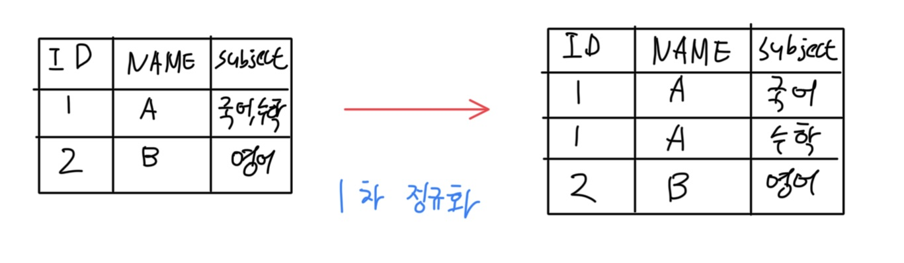
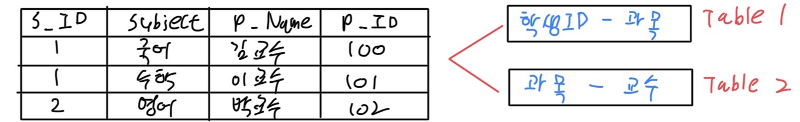

    <strong class="sidebar-title" style="color:black">목차</strong>
    <ul class="sidebar-list">
        <li><a href="#정규화" class="sidebar-link" onclick="scrollToSection(event, '정규화')">정규화</a></li>
        <li><a href="#정규화의-장점" class="sidebar-link" onclick="scrollToSection(event, '정규화의-특징-및-장점')">정규화의 장점</a></li>
       <li><a href="#정규화의-단점" class="sidebar-link" onclick="scrollToSection(event, '정규화의-단점')">정규화의 단점</a></li>
       <li><a href="#정규화의-종류" class="sidebar-link" onclick="scrollToSection(event, '정규화의-종류')">정규화의 종류</a></li>
    </ul>

##### 정규화

-  엔티티를 작은 단위로 분리하는 과정
- 논리 데이터 모델에서 행하는 과정

 

---

##### 정규화의 특징 및 장점

- 데이터 무결성을 위해 수행
  - 데이터 전송 중 손실 방지
- 최소한의 데이터만을 하나의 엔티티에 넣는 과정
- 데이터 분해 과정
- 데이터 **일관성** 확보
- 데이터 **독립성** 확보
  - 데이터 중복 제거
- 데이터 유언성 확보
  - 필요 데이터들의 분할로 유연하게 접근 가능
- 입력, 수정, 삭제 성능은 일반적으로 향상
  - 조회 성능이 저하 될 수 있음

 

---

##### 정규화의 단점

- 엔티티 갯수 증가
- 관계 증가
- 데이터 조회 시 여러번의 조인이 요구
- 조회 성능의 저하
  - 정규화 증가 -> 조회 성능 하락

 

---

##### 정규화의 종류

-  제 1 정규화
  - 테이블 칼럼들이 원자성을 갖게 하기 위해 엔티티를 분해
    - 하나의 인스턴스가 비슷한 속성을 여러개 가지지 않게 하기 위해 분리하는 것
  - 중복되는 속성값을 분리
    

 

-  제 2 정규화
  - 엔티티의 모든 일반 속성은 반드시 주 식별자의 모든 속성들에 '부분 종속'이 아닌
    '완전 종속'을 가져야 함
  - 주 식별자가 1개
    

 
 

-  제 3 정규화
  - 정규화된 엔티티의 일반 속성들은 주 식별자에만 함수적 종속을 가져야 한다.
  - A -> B || B -> C와 같은 이행적 종속을 이루는 TABLE일 때 이러한 이행적 종속을 깨도록 추가적인 엔티티를 만들고 관계를 형성해주는 것
- BCNF 정규화
  - 모든 결정자가 후보키가 되도록 테이블을 분해하는 것

---

